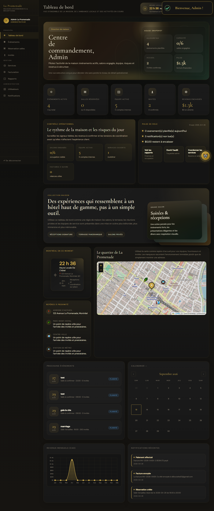
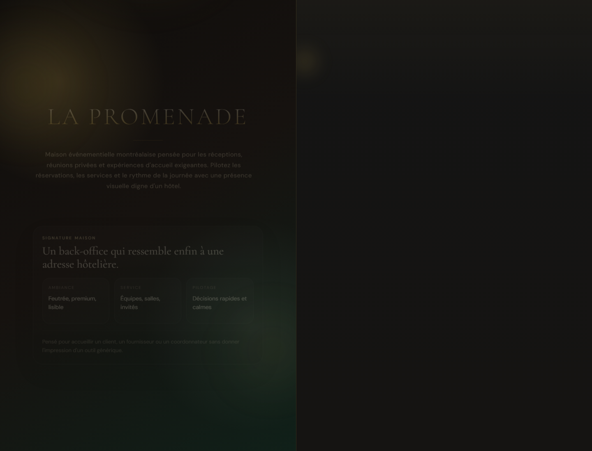
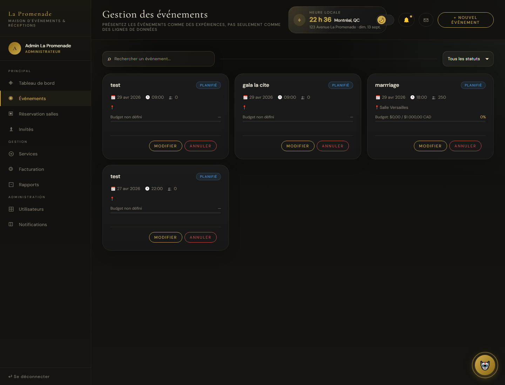
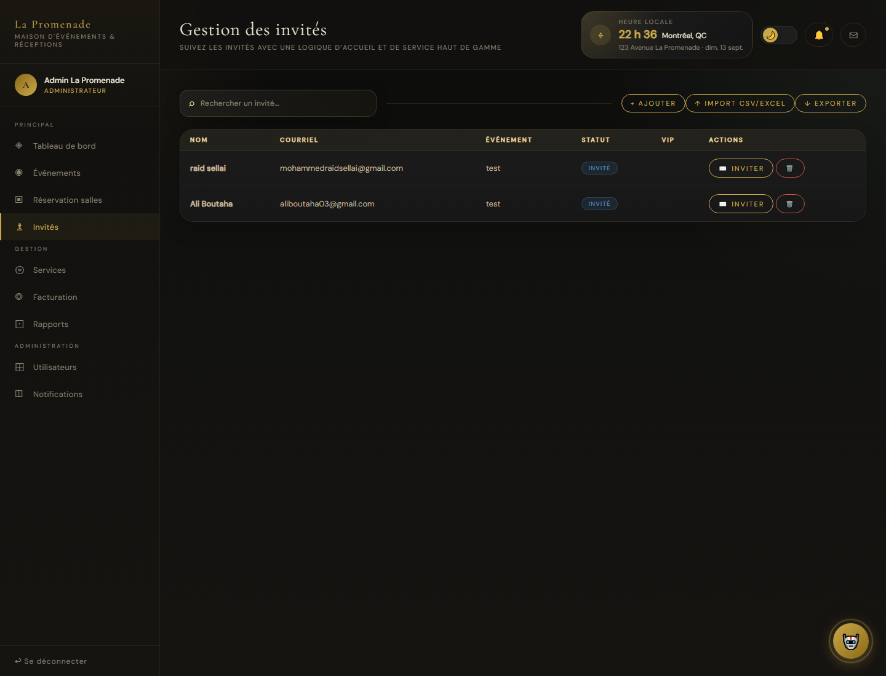

# Hotel La Promenade - Plateforme de Gestion des Evenements

Application web interne pour gerer les evenements, les salles, les invites, les services, les factures, les utilisateurs et les notifications d'un hotel.



---

# Apercu

Hotel La Promenade centralise les operations evenementielles d'un hotel dans une interface premium, responsive et orientee roles.

- Creer et suivre des evenements.
- Reserver des salles et consulter le calendrier.
- Importer, gerer et inviter des participants par courriel.
- Ajouter des services comme traiteur, decoration, photo, DJ ou audiovisuel.
- Generer des factures, recus et rapports financiers.
- Echanger des messages internes entre utilisateurs.
- Utiliser un concierge IA avec fallback operationnel.
- Recevoir un debrief concierge Telegram admin-only.



---

# Captures d'ecran

## Evenements

Gestion des evenements avec cartes, statuts, calendrier et actions d'administration.



## Reservation des salles

Catalogue des salles, filtres visuels, reservation et calendrier optimise.


## Invites

Ajout manuel, import CSV/XLS/XLSX, suivi des statuts et envoi d'invitations par Gmail API.



## Facturation

Creation de factures, paiement, recus PDF, envoi par email et rapports.


---

# Fonctionnalites implementees

# Obligatoires

- Authentification JWT avec comptes par role.
- Roles: administrateur, organisateur, coordonnateur, comptabilite.
- Gestion complete des evenements: creation, modification, annulation et affichage par role.
- Gestion des invites avec import CSV, XLS et XLSX.
- Envoi d'invitations par courriel vers n'importe quelle adresse valide via Gmail API.
- Reservation de salles avec validation des conflits horaires.
- Calendrier pour evenements et reservations.
- Demandes de services evenementiels.
- Facturation avec taxes, paiements, recus et PDF.
- Rapports financiers et operationnels.
- Notifications temps reel et historique.
- Gestion des utilisateurs par administrateur.
- Journal d'audit administrateur.
- Interface responsive desktop/mobile.
- Tests automatises backend, UI et stress test.

# Bonus implementes

- Concierge IA avec actions automatiques sans LLM si les fournisseurs sont indisponibles.
- Debrief Telegram admin-only avec audio local.
- Chat interne entre utilisateurs.
- Dashboard personnalise selon le role.
- Design hotelier premium avec hero, cartes interactives et ambiance visuelle.
- Cartographie/localisation et bloc heure locale.
- Fallbacks reseau et validations de securite cote serveur.

---

# Choix techniques

- **Runtime**: Node.js
- **Framework backend**: Express.js
- **Frontend**: HTML, CSS, JavaScript vanilla
- **Base de donnees**: SQLite
- **Temps reel**: Socket.IO
- **Authentification**: JWT + bcrypt
- **Emails**: Gmail API en production, SMTP Gmail possible en local
- **Import Excel/CSV**: SheetJS `xlsx`
- **PDF**: PDFKit
- **Tests**: Node test runner + Playwright + scripts de stress
- **Deploiement**: Railway
- **Controle de version**: Git / GitHub

---

# Installation & Lancement

## Prerequis

- Node.js 20+
- npm
- Chromium Playwright pour les tests UI

## Etapes

```bash
# 1. Installer les dependances
npm install

# 2. Installer le navigateur de test
npx playwright install chromium

# 3. Copier les variables d'environnement
cp .env.example .env

# 4. Lancer le serveur
npm start
```

Ouvrir ensuite:

```text
http://localhost:3000
```

En developpement:

```bash
npm run dev
```

---

# Variables d'environnement

Exemples principaux:

```env
JWT_SECRET=replace-with-a-long-random-secret
BOOTSTRAP_ADMIN_EMAIL=admin@lapromenade.com
BOOTSTRAP_ADMIN_PASSWORD=admin123
DEMO_USER_PASSWORD=admin123

GMAIL_USER=
GMAIL_APP_PASS=
GOOGLE_CLIENT_ID=
GOOGLE_CLIENT_SECRET=
GOOGLE_REFRESH_TOKEN=

GEMINI_API_KEY=
GROQ_API_KEY=
TELEGRAM_BOT_TOKEN=
TELEGRAM_ADMIN_CHAT_ID=
```

Important:

- Ne jamais pousser `.env`.
- Les secrets doivent etre configures dans Railway Variables.
- Le token Gmail utilise par cette application demande uniquement le scope `gmail.send`.

---

# Comptes de demonstration

Par defaut en local:

```text
admin@lapromenade.com
organisateur@lapromenade.com
coordonnateur@lapromenade.com
compta@lapromenade.com
```

Le mot de passe depend de `.env`:

```env
BOOTSTRAP_ADMIN_PASSWORD=
DEMO_USER_PASSWORD=
```

---

# Tests

Tests backend et integration:

```bash
npm test
```

Test complet de presentation:

```bash
npm run test:master
```

Le master test execute:

- Suite Node.js.
- Parcours navigateur multi-roles avec Playwright.
- Stress test end-to-end: auth, pages, reservations, services, factures, emails, paiements, rapports, IA et Telegram.

---

# Structure du projet

```text
hotel-promenade/
|-- server.js
|-- concierge-telegram.js
|-- package.json
|-- railway.json
|-- public/
|   |-- index.html
|   |-- app.js
|   |-- api-integration.js
|   |-- LOGO.png
|-- tests/
|   |-- smoke.test.js
|   |-- chat-fallback.test.js
|   |-- concierge.test.js
|-- scripts/
|   |-- master-test.js
|   |-- stress-test.js
|   |-- ui-master-test.js
|-- docs/
|   |-- screenshots/
|-- .env.example
|-- .gitignore
```

---

# API principales

```text
POST   /api/auth/login
POST   /api/auth/register

GET    /api/events
POST   /api/events
PUT    /api/events/:id
DELETE /api/events/:id

GET    /api/guests
POST   /api/guests
POST   /api/guests/import
POST   /api/guests/:id/invite

GET    /api/rooms
POST   /api/rooms/reserve

GET    /api/services
POST   /api/services

GET    /api/invoices
POST   /api/invoices
POST   /api/invoices/:id/send
POST   /api/invoices/:id/pay

GET    /api/users
POST   /api/users
PUT    /api/users/:id

POST   /api/chat
POST   /api/concierge/debrief
```

---

# Auteur

Projet realise par Ali Boutaha - 2741927.
